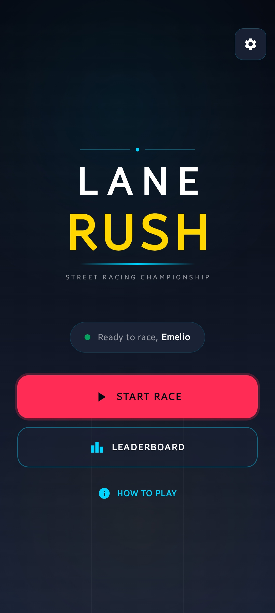
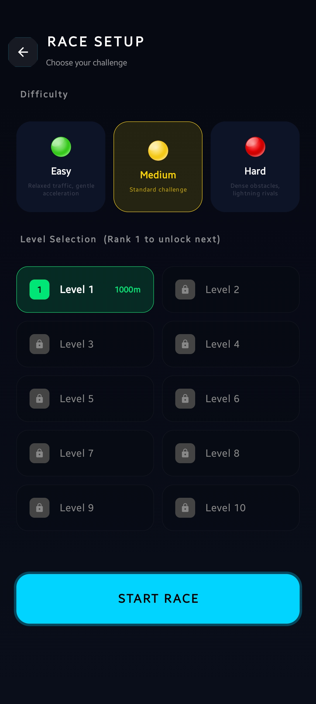
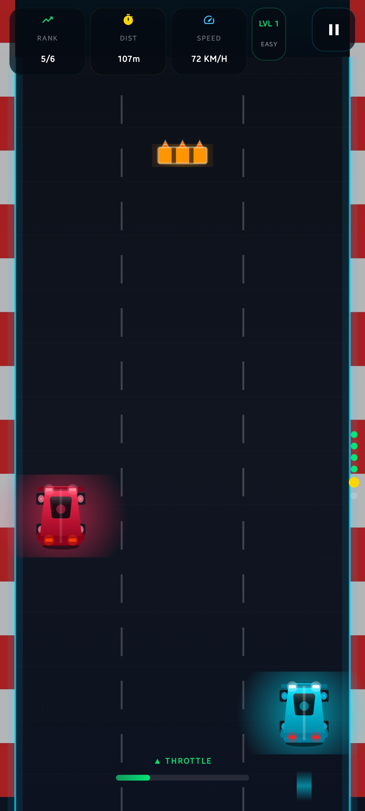
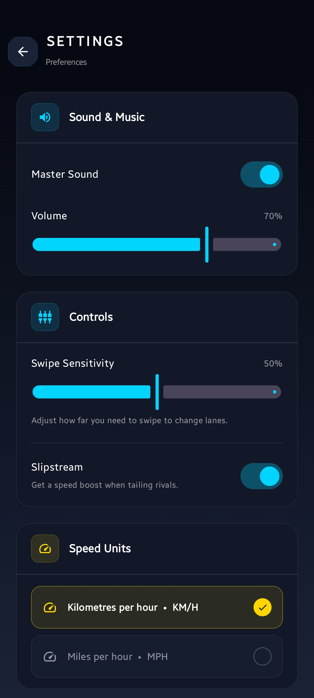

# Lane Rush - 3-Lane Android Racer

Lane Rush is a high-performance, production-ready Android game built with **Kotlin**, **Jetpack Compose**, and **Firebase**. It features a 3-lane racing mechanic with AI rivals, dynamic obstacles, and a global leaderboard.

## 🚀 Features

- **Dynamic Game Engine**: Smooth 60fps game loop using Kotlin Coroutines and StateFlow.
- **Advanced Metrics**: Real-time tracking of Peak Speed and Average Speed.
- **Level Progression System**: 10 levels that must be unlocked sequentially by finishing in Rank 1.
- **Customizable Settings**: Toggle between KMH/MPH, Light/Dark themes, adjust Sound/Volume, and view the Developer Profile.
- **Swipe Controls**: Intuitive lane-switching via swipe gestures.
- **Audio Experience**: High-energy racing theme song and sound effects.
- **AI Rivals & Obstacles**: Challenging race against 5 AI competitors and randomized obstacles.
- **Clean Architecture**: Decoupled layers (Domain, Data, UI) for maximum maintainability.
- **Firebase Integration**:
    - **Authentication**: Google Sign-In for seamless user boarding.
    - **Firestore**: Real-time storage for user profiles and global high scores.
- **Modern UI**: Fully declarative HUD and menus using Jetpack Compose and Material3.

## 📸 Screenshots

|                                Main Menu                                 |                                Level Selection                                |                             High-Speed Gameplay                              |                             Settings & Controls                              |
|:------------------------------------------------------------------------:|:-----------------------------------------------------------------------------:|:----------------------------------------------------------------------------:|:----------------------------------------------------------------------------:|
|  |  |  |  |

## 🕹️ How to Play

### Controls
Lane Rush uses simple, intuitive touch gestures for high-speed racing:

- **🔥 Accelerate (Throttle)**: **Hold your finger anywhere** on the screen. The car will accelerate towards its top speed.
- **🛑 Brake / Coast**: **Release your finger** to slow down. Use this to navigate tight spots or avoid fast-approaching obstacles.
- **↔️ Switch Lanes**: **Swipe Left or Right** anywhere on the screen to quickly jump between the 3 lanes.
- **⏸️ Pause**: Tap the **Pause icon** in the top-right corner to freeze the action.

### Gameplay
1. **Choose your Level**: Select from 10 increasingly difficult levels. Levels must be unlocked sequentially.
2. **Unlock Rule**: To unlock the next level, you **MUST finish the current race in Rank 1**.
3. **Select Difficulty**: 
    - **Easy**: Forgiving traffic and slower rivals.
    - **Medium**: The standard competitive experience.
    - **Hard**: Dense obstacles and aggressive AI opponents.
    - *All difficulties are unlocked from the start.*
4. **Race to the Finish**: Reach the target distance. If you finish but are not Rank 1, it is considered a loss!
5. **Avoid Crashes**: Hitting an obstacle or another car ends the race immediately.

## 🛠 Tech Stack

- **Language**: Kotlin
- **UI Framework**: Jetpack Compose
- **Asynchronous Logic**: Kotlin Coroutines & Flow
- **Backend**: Firebase (Auth, Firestore)
- **Navigation**: Compose Navigation
- **Architecture**: MVVM + Clean Architecture

## 📦 Setup Instructions

### ⚠️ Security Notice
**Do not commit your `google-services.json` or any API keys.** This repository includes a `.gitignore` that protects these files. You must provide your own Firebase configuration to run the project.

### 1. Firebase Configuration
1. Go to the [Firebase Console](https://console.firebase.google.com/).
2. Create a new project named `Lane Rush`.
3. Add an Android App to the project. Use the package name `com.lanerush`.
4. Download the `google-services.json` and place it in the `app/` directory.
5. **Important**: Add your SHA-1 fingerprint to the Firebase project settings to enable Google Sign-In.
6. Enable **Google Sign-In** in the Authentication section of the Firebase Console.
7. Create a **Firestore Database** and set up the following collections:
    - `users`: Stores user profiles and high scores.
    - `scores`: Stores all race results.

### 2. Local Environment
Ensure you have the following in your `local.properties` if needed for custom-builds:
```properties
# Add any local environment variables here
```

### 2. Firestore Collections Structure
The app expects the following collections:
- `users`: `{ uid: String, displayName: String, photoUrl: String, highScore: Int }`
- `scores`: `{ uid: String, displayName: String, score: Int, timestamp: Long }`

### 3. Build & Run

```bash
# 1. Clone the repo
git clone https://github.com/Emelio101/lane-rush.git
cd lane-rush

# 2. Open in Android Studio and let Gradle sync

# 3. Build debug APK
./gradlew assembleDebug

# 4. Install on connected device
./gradlew installDebug
```

## 📁 Project Structure

```text
app/src/main/java/com/lanerush/
├── data/                       # Data Layer Implementation
│   ├── auth/                   # Firebase Auth (AuthRepositoryImpl)
│   ├── leaderboard/            # Firestore Rankings (LeaderboardRepositoryImpl)
│   └── settings/               # DataStore Persistence (SettingsRepository)
├── domain/                     # Domain Layer (Business Logic)
│   ├── model/                  # Data Models & Game State (GameState, Levels, UserSettings)
│   └── repository/             # Repository Interfaces
├── engine/                     # Core Game Engine
│   ├── GameEngine.kt           # Game Loop, Physics & Collisions
│   └── SoundManager.kt         # Audio Effects & Music Management
├── ui/                         # UI Layer (Jetpack Compose)
│   ├── screens/                # UI Screens (Game, Home, Leaderboard, Login, Settings)
│   └── theme/                  # Material 3 Theme (Color, Type, Theme)
└── MainActivity.kt             # App Entry Point, Navigation & Lifecycle Management
```

## 📐 Architecture Overview

- **Domain Layer**: Contains the core business logic, models, and repository interfaces.
- **Data Layer**: Implements the repositories using Firebase SDKs.
- **Engine**: The `GameEngine` manages the tick-based logic, collision detection, and state updates.
- **UI Layer**: ViewModels manage the state for screens, which are built entirely with Jetpack Compose.

## 🤝 Contributing

Contributions are welcome!

1. **Fork** the repository
2. **Create a feature branch**
   ```bash
   git checkout -b feature/your-feature-name
   ```
3. **Commit your changes**
   ```bash
   git commit -m "feat: add your feature"
   ```
4. **Push and open a Pull Request**
   ```bash
   git push origin feature/your-feature-name
   ```

Please follow standard Kotlin coding conventions and ensure the project builds cleanly before
submitting.

---

## 📄 License

This project is licensed under the **MIT License** — see the [LICENSE](LICENSE) file for details.

---

## 👨‍💻 About the Developer

**Emmanuel C. Phiri**  
*Mobile Apps Developer*

Passionate about creating high-performance, visually engaging mobile experiences with Kotlin and Jetpack Compose.

- **GitHub**: [@Emelio101](https://github.com/Emelio101)
- **LinkedIn**: [Emmanuel C. Phiri](https://www.linkedin.com/in/emmanuel-c-phiri-13420315b/)
- **WakaTime**: [@Emelio101](https://wakatime.com/@Emelio101)

---

## 🙏 Acknowledgments

- [Jetpack Compose](https://developer.android.com/jetpack/compose) — Modern Android UI toolkit
- [Material Design 3](https://m3.material.io/) — Design system
- [Firebase](https://firebase.google.com/) — Real-time backend and auth
- [Freesound.org](https://freesound.org/) — Sound assets (see individual licenses in `app/src/main/res/raw/`)
